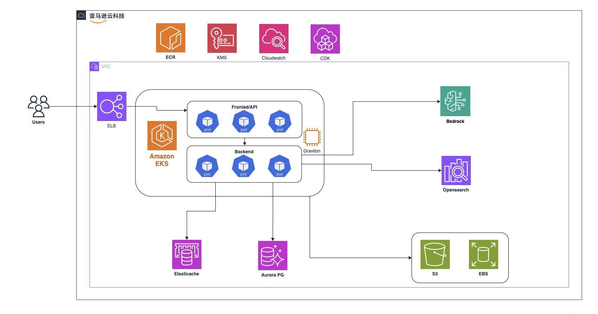
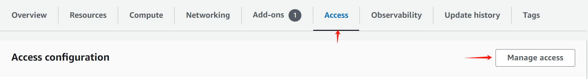
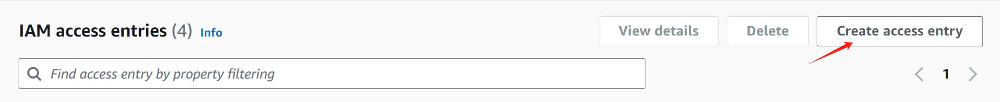

# Dify Enterprise on AWS

Deploy Dify Enterprise on AWS using CDK.



# Components

### Testing Deployment

| **Component**   | **Helm Chart Value** | **Count** | **vCPU** | **Memory (GB)** | **Storage (GB)** | **Notes** |
| --------------- | -------------------- | --------- | -------- | --------------- | ---------------- | --------- |
| S3              | persistence          | 1         |          |                 |                  |           |
| Redis DB        | externalRedis        | 1         | 2        | 6.38            |                  |           |
| RDS Postgres DB | externalPostgres     | 2         | 2        | 8               |                  |           |
| K8S Worker Node |                      | 1         | 4        | 16              | 100              |           |
| OpenSearch      | vectorDB             | 1         | 2        | 16              | 100              |           |

### Production Deployment

| **Component**   | **Helm Chart Value** | **Count** | **vCPU** | **Memory (GB)** | **Storage (GB)** | **Notes** |
| --------------- | -------------------- | --------- | -------- | --------------- | ---------------- | --------- |
| S3              | persistence          | 1         |          |                 |                  |           |
| Redis DB        | externalRedis        | 1         | 2        | 12.93           |                  |           |
| RDS Postgres DB | externalPostgres     | 1         | 4        | 32              |                  |           |
| K8S Worker Node |                      | 6         | 8        | 32              | 100              |           |
| OpenSearch      | vectorDB             | 2         | 8        | 64              | 100              |           |


# Deployment

> The whole process is expected to take 60 mins

1. ### Configure AWS CLI:

   Install and configure the [AWS CLI](https://docs.aws.amazon.com/cli/latest/userguide/getting-started-install.html):

   ```bash
   aws configure
   ```

2. ### Clone this repository:

   ```bash
   git clone https://github.com/langgenius/aws-cdk-for-dify.git
   ```

3. ### Install NodeJS Dependencies:

   ```bash
   npm install
   ```

4. ### Configure environment variables:

   ```bash
   cp .env.example .env
   ```

   Modify the environment variable values in the `.env` file.

   - `ENVIRONMENT`: Specifies the deployment environment; must be either `test` or `prod`.

   - `CDK_DEFAULT_REGION`: The AWS region where Dify Enterprise will be deployed.

   - `CDK_DEFAULT_ACCOUNT`: Your AWS account ID.

   - `DEPLOY_VPC_ID`: The ID of an existing VPC for deployment. If not set, CDK will create one for you.

   - **Note:** **If using an existing VPC**

     - Make sure you have 2 or more **public** subnets for Application Load Balancer, and 2 or more **private** subnets can access internet(associated with NAT) to pull docker image from internet.

     - Add **Tag** for the subnets(**Otherwise**, Step 6 will show WARN about auto-tag failed, which will result in the Application Load Balancer failing to be created successfully.):

       | Subnet Type | Tag key                         | tag value |
       | ----------- | ------------------------------- | --------- |
       | public      | kubernetes.io/role/elb          | 1         |
       | private     | kubernetes.io/role/internal-elb | 1         |

   - Subnets Configuration (`DEPLOY_VPC_ID` required, comma-separated without spaces, **private subnets** is recommended by AWS security best practices):

     - `EKS_CLUSTER_SUBNETS`: Subnet IDs for the EKS control plane. Requires at least 2 subnets in different Availability Zones (AZs).
     - `EKS_NODES_SUBNETS`: Subnet IDs for the EKS worker nodes. Requires at least 2 subnets in different AZs.
     - `REDIS_SUBNETS`: Subnet IDs for Redis deployment.
     - `RDS_SUBNETS`: subnet ids for RDS database. (At least 2 with different AZs)
     - `OPENSEARCH_SUBNETS`: Subnet IDs for OpenSearch deployment.
     - `OPENSEARCH_ADMINNAME`: OpenSearch Domain master ame.
     - `OPENSEARCH_PASSWORD`: OpenSearch Domain master password.

   - `AWS_EKS_CHART_REPO_URL`: (For AWS China regions ONLY) The AWS EKS Helm chart repository URL.

   - `RDS_PUBLIC_ACCESSIBLE`: Set to `true` to make RDS publicly accessible (NOT RECOMMENDED).

   **Note:**

   - If you are using AWS China regions, you must configure the `AWS_EKS_CHART_REPO_URL` for proper functionality. Please contact Dify Team for the URL.
   - It is recommended to use an existing VPC for easier resource access.

5. ### CDK Bootstrap:

   Initialize the CDK environment:

   ```bash
   npm run init
   ```

6. ### CDK Deploy:

   - Deploy Dify Enterprise:

     ```bash
     npm run deploy
     ```

7. ### Update AWS EKS Access Permissions:

   1. Navigate to the EKS Cluster panel, select the "Access" menu, and click on "Manage access":
      
   2. In the "Manage access" dialog, select "EKS API and ConfigMap," then click "Save Changes."
   3. In the IAM Access Entries panel, click "Create access entry":
      
   4. Add your IAM user and assign the following permissions:
      - `AmazonEKSAdminPolicy`
      - `AmazonEKSAdminViewPolicy`
      - `AmazonEKSClusterAdminPolicy`

8. ### Configure `kubeconfig` to access the Kubernetes (K8S) cluster locally:

   ```bash
   aws eks update-kubeconfig --region <cn-northwest-1> --name <Dify-Testing-DifyStackTest-EKS>
   ```

   Adjust the `region` and `name` parameters according to your deployment:

   - **region:** The AWS region where your cluster is deployed.
   - **name:** The EKS cluster name.

9. ### Configure Permissions via IRSA

   1. **Enable the IAM OIDC provider for your EKS cluster**

      Follow the [official AWS documentation](https://docs.aws.amazon.com/eks/latest/userguide/enable-iam-roles-for-service-accounts.html) to associate your EKS cluster with an OIDC identity provider. This step is required before you can use IAM Roles for Service Accounts (IRSA).

   2. **Create a JSON policy document** (for example, iam-policy.json) defining the S3 permissions your pods need:

    ```json
      {
        "Version": "2012-10-17",
        "Statement": [
            {
                "Effect": "Allow",
                "Action": [
                    "s3:ListBucket"
                ],
                "Resource": "arn:aws:s3:::YOUR_BUCKET"
            },
            {
                "Sid": "List",
                "Effect": "Allow",
                "Action": [
                    "s3:GetObject",
                    "s3:GetObjectVersion"
                ],
                "Resource": "arn:aws:s3:::YOUR_BUCKET/*"
            }
          ]
      }
    ```

   3. **Create an IAM policy** using the document you just created:

      ```bash
      aws iam create-policy \
        --policy-name YOUR-IAM-POLICY \
        --policy-document file://iam-policy.json
      ```

   4. **Create an IAM role and annotate your service account**.

      You can do this via the AWS console (see how to [create an IAM role](https://docs.aws.amazon.com/eks/latest/userguide/iam-roles-for-service-accounts.html) and [annotate a service account](https://docs.aws.amazon.com/eks/latest/userguide/configure-sts-endpoint.html)), or by running:

      ```bash
      eksctl create iamserviceaccount \
        --name YOUR-SERVICEACCOUNT \
        --namespace YOUR-NAMESPACE \
        --cluster YOUR-CLUSTER \
        --attach-policy-arn arn:aws:iam::xxxxxxxxxx:policy/YOUR-IAM-POLICY \
        --approve
      ```

      This command does two things:

      - Creates (or updates) the IAM role to trust the EKS OIDC provider.
      - Annotates the specified Kubernetes service account with the role’s ARN.

   5. Reference your service account in the Helm `values.yaml`:

      ```yaml
      api:
        serviceAccountName: YOUR-SERVICEACCOUNT

      ```

      Once deployed, the pod will assume the IAM role and have the specified S3 access (or other permissions) through IRSA.

10. ### Data Persistence Configure:

   Change the Helm `values.yaml` file. To enable it, modify the `persistence` section as follows, replace {your-region-name} and {your-s3-bucket-name} with the name of resource created by CDK, make sure you have turn `useAwsManagedIam` on:

   ```yaml
   persistence:
     type: "s3"
     s3:
       endpoint: "https://s3.{your-region-name}.amazonaws.com"
       region: "{your-region-name}"
       bucketName: "{your-s3-bucket-name}"
       useAwsManagedIam: true
   ```

11. ### Database Configure:

    Change the Helm `values.yaml` file, **remove** `postgre` section, and modify the `externalPostgres` section as follows, replace {your-postgres-endpoint} and {your-postgres-password} with data stored in the **Secret Manager** of AWS:

    ```yaml
    postgre:
      enabled: false
    externalPostgres:
      enabled: true
      address: "{your-postgres-endpoint}"
      port: 5432
      credentials:
        dify:
          database: "postgres"
          username: "clusteradmin"
          password: "{your-postgres-password}"
          sslmode: "disable"
        enterprise:
          database: "postgres"
          username: "clusteradmin"
          password: "{your-postgres-password}"
          sslmode: "disable"
    ```

12. ### Redis Configure:

    Change the Helm `values.yaml` file, **remove** `redis` section, and modify the `externalRedis` section as follows, replace {your-redis-host} with `Primary endpoint` in console of  **ElastiCache-Redis OSS caches**

    **Note:** **remove** the port number of the `Primary endpoint`

    ```yaml
    redis:
      enabled: false
    externalRedis:
      enabled: true
      host: "{your-redis-host}"
      port: 6379
      username: ""
      password: ""
      useSSL: false
    ```

13. ### VectorDatabase Configure:

    Change the Helm `values.yaml` file,  modify the `externalType` section as follows:
     1. replace `{openSearch_endpont}` with aws Opensearch instant's **Domain endpoint**, remove `https://` and use the left.
     2. replace the `<OPENSEARCH_ADMINNAME>` and `<OPENSEARCH_PASSWORD>` with the value you have set in `.env`

    ```yaml
    vectorDB:
      useExternal: true
      externalType: "opensearch"
      externalOpenSearch:
        host: "{openSearch_endpont}"
        port: 443
        user: "<OPENSEARCH_ADMINNAME>"
        password: "<OPENSEARCH_PASSWORD>"
        useTLS: true
    ```

14. ### Set docker image pull secret

    You need to set the docker image pull secret before installing Dify Enterprise.
    
    **Note:** If you haven't got the username and password, please contact us, email address:[Support@dify.ai](support@dify.ai)

15. ### TLS

    #### For testing:

    If you are just testing the deploy process, you can just ignore this step and go on.

    #### For production:

    Go to AWS `ACM` to require the certificates of the domain you declared in helm chart configuration file `values.yaml`:

    ```yaml
      consoleApiDomain: "console.xxxx.com"
      consoleWebDomain: "console.xxxx.com"
      serviceApiDomain: "api.xxxx.com"
      appApiDomain: "app.xxxx.com"
      appWebDomain: "app.xxxx.com"
      filesDomain: "upload.xxxx.com"
      enterpriseDomain: "enterprise.xxxx.com"
    ```

    they are:

    ```yaml
    console.xxxx.com
    api.xxxx.com
    app.xxxx.com
    upload.xxxx.com
    enterprise.xxxx.com
    ```

    go to your domain service provider (e.g. cloud flare, aws route53, etc.) and setup the `cname` to prove your ownership of these domains.

    **change the values.yaml param: global.useTLS**

    ```
      useTLS: true
    ```

16. ### AWS Load Balancer Configuration

    It is recommended to use an AWS Application Load Balancer (ALB) for your ingress configuration in the Helm `values.yaml` file. To enable it, modify the `ingress` section as follows:

    **For testing:**

    ```yaml
    ingress:
        enabled: true
        className: "alb"
        annotations: {
            # Existing annotations
            ...
            # Add the following annotations
            alb.ingress.kubernetes.io/target-type: "ip",
            alb.ingress.kubernetes.io/scheme: "internet-facing",
        }
    ```

    **For production:**

    refer to: [AWS load balancer controller setup](https://kubernetes-sigs.github.io/aws-load-balancer-controller/v2.9/guide/ingress/cert_discovery/)

    ```yaml
    ingress:
      enabled: true
      className: "alb"
      annotations: {
        # set file upload size limit
            alb.ingress.kubernetes.io/target-type: "ip",
            alb.ingress.kubernetes.io/scheme: "internet-facing",
            alb.ingress.kubernetes.io/listen-ports: '[{"HTTPS":443}]'
      }
    ```

17. ### Install Dify Enterprise

    Dify Enterprise is deployed using Helm. 

    ```bash
    helm repo add dify https://langgenius.github.io/dify-helm
    helm repo update
    
    helm upgrade -i dify -f values.yaml dify/dify
    ```

18. ### Access Dify Enterprise

    #### For testing:

    After setting up, get the temperally external IP of the ALB.

    ```bash
    ping {aws_alb_dns}
    ```

    Then add the following line to your `/etc/hosts` file.

    ```bash
    4.152.1.216 console.dify.local
    4.152.1.216 app.dify.local
    4.152.1.216 api.dify.local
    4.152.1.216 upload.dify.local
    4.152.1.216 enterprise.dify.local
    ```

    #### For production

    Go to your Domain service provider, and set up DNS to the ALB address(Go to AWS-EC2-Load Balancer to get the dns of alb):

    | domain              | cname     |
    | ------------------- | --------- |
    | api.xxxx.com        | <alb_dns> |
    | app.xxxx.com        | <alb_dns> |
    | upload.xxxx.com     | <alb_dns> |
    | enterprise.xxxx.com | <alb_dns> |
    | console.xxxx.com    | <alb_dns> |

    

19. ### Verify Installation

    **Warning**: You have to set up Dify Console `http://console.dify.local` first before login to Dify Enterprise Dashboard `http://enterprise.dify.local`.

    - Dify Console: visit `http://console.dify.local` and finish the installation.

    - Enterprise Dashboard: visit `http://enterprise.dify.local`, and login with the default email and password. You can change the password after login.

      ```
      email: dashboard@dify.ai
      password: difyai123456
      ```

    

# Destroy

> The process may take 20 mins.

Destroy the deployment for the environment specified in the `.env` file under `ENVIRONMENT`.

```bash
npm run destroy
```

**Note**: login to AWS console, review the VPC, and make sure the VPC created by CDK has destroyed, if not, please Check `Cloudformation` and perform the deletion operation.

# Advanced Configuration

### Advanced Configuration

To customize deployment configurations, modify the [test.ts](./configs/test.ts) file for the testing environment or the [prod.ts](./configs/prod.ts) file for the production environment.
