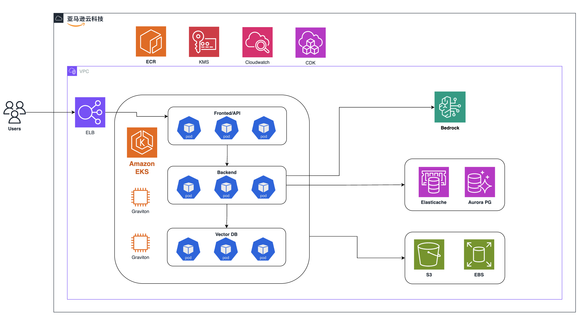

# Dify Enterprise on AWS

[简体中文](./README.zh.md)

Deploy Dify Enterprise on AWS using CDK.



## Components

### Testing Deployment

| **Component**       | **Helm Chart Value** | **Count** | **vCPU** | **Memory (GB)** | **Storage (GB)** | **Notes** |
| ------------------- | -------------------- | --------- | -------- | --------------- | ---------------- | --------- |
| S3                  | persistence          | 1         |          |                 |                  |           |
| Redis DB            | externalRedis        | 1         | 2        | 6.38            |                  |           |
| RDS Postgres DB     | externalPostgres     | 2         | 2        | 8               |                  |           |
| K8S Worker Node     |                      | 1         | 4        | 16              | 100              |           |
| EC2 (for Vector DB) | vectorDB             | 1         | 4        | 8               | 100              |           |

### Production Deployment

| **Component**       | **Helm Chart Value** | **Count** | **vCPU** | **Memory (GB)** | **Storage (GB)** | **Notes** |
| ------------------- | -------------------- | --------- | -------- | --------------- | ---------------- | --------- |
| S3                  | persistence          | 1         |          |                 |                  |           |
| Redis DB            | externalRedis        | 1         | 2        | 12.93           |                  |           |
| RDS Postgres DB     | externalPostgres     | 1         | 4        | 32              |                  |           |
| K8S Worker Node     |                      | 6         | 8        | 32              | 100              |           |
| EC2 (for Vector DB) | vectorDB             | 3         | 16       | 64              | 100              |           |

## Deployment

### Prerequisites

1. **Configure AWS CLI:**

   Install and configure the [AWS CLI](https://docs.aws.amazon.com/cli/latest/userguide/getting-started-install.html):

   ```bash
   aws configure
   ```

2. **Clone this repository:**

   ```bash
   git clone https://github.com/langgenius/aws-cdk-for-dify.git
   ```

3. **Install NodeJS Dependencies:**

   ```bash
   npm install
   ```

4. **Configure environment variables:**

   ```bash
   cp env.example .env
   ```

   Modify the environment variable values in the `.env` file.

   **Note:**
   - If you are using the AWS China region, you need to configure the `AWS_EKS_CHART_REPO_URL` for proper functionality.
   - It is recommended to use an existing VPC for easier resource access.

5. **CDK Bootstrap:**

   Initialize the CDK environment:

   ```bash
   npm run init
   ```

6. **CDK Deploy:**
   - Deploy the Testing environment:

     ```bash
     npm run deploy-test
     ```

   - Deploy the Production environment:

     ```bash
     npm run deploy-prod
     ```

7. **Update AWS EKS Access Permissions:**
   1. Navigate to the EKS Cluster panel, select the "Access" menu, and click on "Manage access":
        
   2. In the "Manage access" dialog, select "EKS API and ConfigMap," then click "Save Changes."
   3. In the IAM Access Entries panel, click "Create access entry":
        
   4. Add your IAM user and assign the following permissions:
        - `AmazonEKSAdminPolicy`
        - `AmazonEKSAdminViewPolicy`
        - `AmazonEKSClusterAdminPolicy`

8. **Configure kubeconfig to access the K8S cluster locally:**

   ```bash
   aws eks update-kubeconfig --region <cn-northwest-1> --name <Dify-Testing-DifyStackTest-EKS>
   ```

   Adjust the `region` and `name` according to your deployment:
   - **region:** The deployment region.
   - **name:** The EKS cluster name (`Dify-Testing-DifyStackTest-EKS` | `Dify-Production-DifyStackProd-EKS`).

9. **CDK Destroy:**

   To destroy the stack:

    ```bash
    npm run destroy
    ```
