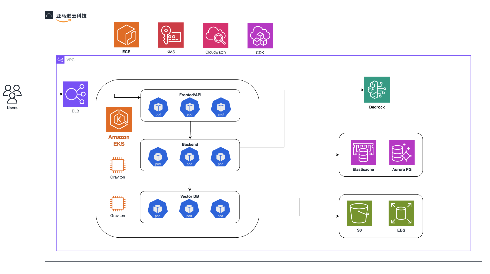
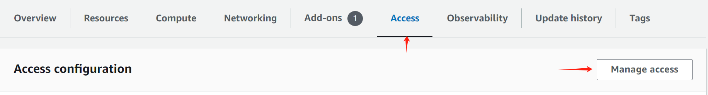

# Dify Enterprise on AWS

[English](./README.md)

用CDK在AWS上部署 Dify Enterprise。



## Components

### Testing Deployment 测试环境参数

| **Component**       | **Helm Chart Value** | **Count** | **vCPU** | **Memory (GB)** | **Storage (GB)** | **Notes** |
| ------------------- | -------------------- | --------- | -------- | --------------- | ---------------- | --------- |
| S3                  | persistence          | 1         |          |                 |                  |           |
| Redis DB            | externalRedis        | 1         | 2        | 6.38            |                  |           |
| RDS Postgres DB     | externalPostgres     | 2         | 2        | 8               |                  |           |
| K8S Worker Node     |                      | 1         | 4        | 16              | 100              |           |
| EC2 (for Vector DB) | vectorDB             | 1         | 4        | 8               | 100              |           |

### Production Deployment 生产环境参数

| **Component**       | **Helm Chart Value** | **Count** | **vCPU** | **Memory (GB)** | **Storage (GB)** | **Notes** |
| ------------------- | -------------------- | --------- | -------- | --------------- | ---------------- | --------- |
| S3                  | persistence          | 1         |          |                 |                  |           |
| Redis DB            | externalRedis        | 1         | 2        | 12.93           |                  |           |
| RDS Postgres DB     | externalPostgres     | 1         | 4        | 32              |                  |           |
| K8S Worker Node     |                      | 6         | 8        | 32              | 100              |           |
| EC2 (for Vector DB) | vectorDB             | 3         | 16       | 64              | 100              |           |

## Deploy

### Prerequisites

1. AWS CLI 配置

   [AWS CLI](https://docs.aws.amazon.com/cli/latest/userguide/getting-started-install.html)

   ```bash
   aws configure
   ```

2. 克隆此仓库

   ```bash
   git clone https://github.com/langgenius/aws-cdk-for-dify.git
   ```

3. 环境依赖: NodeJS

   ```bash
   npm install
   ```

4. 配置环境变量

   ```bash
   cp env.example .env
   ```

   修改文件里的环境变量值。
   注意:
   - 如果您使用的是AWS中国区，则需要配置`AWS_EKS_CHART_REPO_URL`才能正常使用。
   - 推荐使用已有的VPC，方便访问资源。

5. CDK bootstrap

   ```bash
   npm run init
   ```

6. CDK deploy
   - 部署Testing环境

        ```bash
        npm run deploy-test
        ```

   - 部署Production环境

        ```bash
        npm run deploy-prod
        ```

7. 修改AWS EKS访问权限
   1. 在EKS Cluster面板中，选择 Access 菜单，点击 "Manage access"
        
   2. 选择 "EKS API and ConfigMap" -> "Save Changes"
   3. 在IAM access entries面板中，点击 "Create access entry"
        
   4. 添加您的IAM用户，然后添加权限:
         - `AmazonEKSAdminPolicy`
         - `AmazonEKSAdminViewPolicy`
         - `AmazonEKSClusterAdminPolicy`
8. 配置kubeconfig以便在本地访问K8S集群

   ```bash
   aws eks update-kubeconfig --region cn-northwest-1 --name Dify-Testing-DifyStackTest-EKS
   ```

   请自行根据需求替换region和name
   - region: 部署地区
   - name: EKS集群名字 (`Dify-Testing-DifyStackTest-EKS` | `Dify-Production-DifyStackProd-EKS`)

9. CDK destroy
    若要删除CDK

    ```bash
    npm run destroy
    ```
